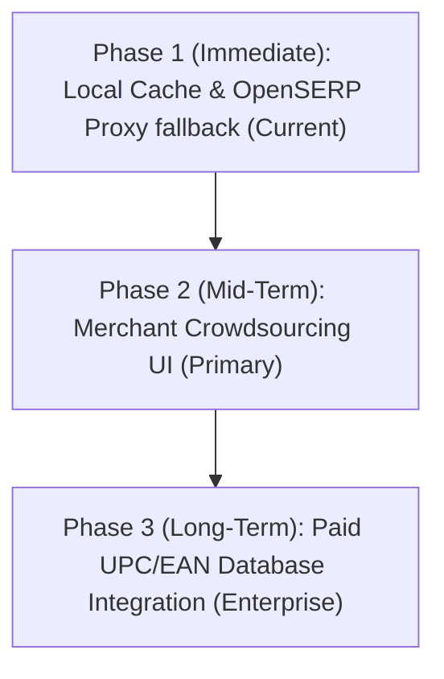

# OZO Hyper-Local Quick Commerce Platform
## Technical Architecture Audit & Due Diligence Review

**Audit Date:** August 3, 2026  
**Auditor:** Lead Systems Architect & Technical Due-Diligence Lead  
**Overall Project Rating:** **7.3 / 10** (Highly Mature Solo Dev Architecture with Production/SecOps Gaps)

---

### Executive Summary

OZO is a hyper-local, high-concurrency 10-30 minute grocery delivery platform. It features robust backend Postgres design, geofenced proximity routing, dynamic markup control, and a server-side Edge SEO prerendering layer. 

While the architecture demonstrates textbook database engineering and advanced SEO strategies rarely seen in solo-developer projects, the codebase currently suffers from gaps in **secrets hygiene**, **automated test coverage**, and **long-term scraping vulnerabilities**. Addressing these critical gaps will transform OZO from a highly sophisticated "jugaad" MVP into a VC-fundable, production-ready system.

---

### Detailed Category Breakdown & Score Justifications

| Audit Category | Score | Detailed Findings & Core Rationale |
| :--- | :---: | :--- |
| **System Design (Multi-Role)** | **8.5/10** | **Strengths:** Clean isolation of Customer, Mart Operator, Rider (Captain), and Admin modules. The waterfall profit margin rules (Product $\rightarrow$ Category $\rightarrow$ Mart $\rightarrow$ Global) implemented via DB triggers represent a highly robust, secure, and performant approach. **Weaknesses:** Lack of a centralized audit trail for margin adjustments across roles. |
| **Database-Level Engineering** | **8.0/10** | **Strengths:** Exceptional Postgres discipline. Strict `SECURITY DEFINER` policies, explicitly hardened `search_path`, active session limit triggers to drop stale tokens, and Haversine-based proximity routing run directly on the database layer. **Weaknesses:** Tight coupling of business calculations to SQL triggers makes local testing and versioning of business logic more difficult. |
| **SEO & Serverless Infrastructure** | **8.0/10** | **Strengths:** Excellent SPA SEO workaround. Edge Functions analyze incoming request headers, proxying bots/crawlers (via `render-seo.ts`) to pre-rendered HTML templates with complete JSON-LD structured schemas, while sending actual users the React bundle. **Weaknesses:** `render-seo.ts` is a monolithic 75KB file with high inline styling and static templates that could be modularized. |
| **Catalog Enrichment Pipeline** | **7.0/10** | **Strengths:** Clever dual-channel solution. The mobile QR-code-to-webcam bridge (`PhoneCapture.jsx`) resolves localized barcode gaps without client-side disk storage. **Weaknesses:** The desktop scraping tool (`image_tool/searcher.py`) targeting Amazon, DuckDuckGo, and JioMart is highly fragile, legally vulnerable, and easily blocked by IP rate-limiting. |
| **Code & Secrets Hygiene** | **5.5/10** | **Strengths:** Clean isolation of React components, Zustand state stores, and migrations. **Weaknesses:** ImageKit private keys were committed in past Git histories. The reliance on ImgBB as a secondary CDN adds unnecessary attack surface. The local Flask utility and PyInstaller builder (`build_exe.py`) in the main repository feel amateurish. |
| **Documentation** | **8.0/10** | **Strengths:** Incredibly detailed README.md covering database migration orders, directory paths, and local setup scripts. **Weaknesses:** The README is bloated and mixes high-level architecture with internal configurations and developer-specific setup guidelines. |
| **Scalability & Maturity** | **6.5/10** | **Strengths:** Scalable Vite code-splitting and asset loading config. Zustand client-side stores are well structured. **Weaknesses:** Zero unit or integration tests, no test framework configured, and a basic CI workflow lacking lint, build, or test validation. |

---

### 1. Security & Secrets Management Remediation

#### Immediate Security Vulnerabilities
1. **Exposed Credentials History:** Although `.env` is ignored by `.gitignore` currently, historic commits containing keys must be completely purged using BFG Repo-Cleaner or `git-filter-repo`.
2. **CDN Consolidation:** The codebase currently uses both ImageKit and ImgBB. Maintaining multiple CDNs introduces additional API endpoints and API keys, multiplying the attack surface. 
3. **Database Vault Migration:** Shift all sensitive database-side secrets (like SMS gateway keys, payment callback keys) to the Supabase Vault (`vault.secrets`) and access them strictly via `security definer` decryption RPC functions, avoiding hardcoded tokens inside migrations or edge functions.

#### Env Configuration Standard
We have established a `.env.example` template at the root of the workspace. This forces developers to register environment variables without risking security leaks.

---

### 2. Proposed Testing Architecture

The complete lack of automated testing is the largest blocker to technical due-diligence. We recommend introducing **Vitest** for unit/integration testing of client utility functions and database-bound logic.

#### Recommended Testing Scope
1. **Unit Tests:**
   - Image optimization logic (`src/utils/imageOptimizer.js`)
   - Product image check logic (`src/utils/productUtils.js`)
   - Zustand stores (mocking Supabase client calls)
2. **Database Integration Tests:**
   - Execute mock SQL assertions using a test database to verify:
     - The Haversine distance proximity logic.
     - The auto-recalculation of profit-margins when a mart updates wholesale prices.
     - Session-limit triggers dropping active sessions when concurrent device count > 2.

---

### 3. Phasing Catalog Enrichment Roadmap
Scraping public search engines and retail channels (Amazon, JioMart) is fragile and legally risky. We propose a phased transition:

- **Phase 1 (Current):** Search OpenSERP (self-hosted Bing/Google scraper) and caching query results locally. Bypasses consumer site endpoints to avoid IP blocks.
- **Phase 2 (Crowdsourced):** Enhance the Mart dashboard to make "Mobile Upload" the primary catalog ingestion flow. Operators use their cameras at onboarding to register products.
- **Phase 3 (Paid API):** Integrate paid barcode databases (such as GS1 India, BarcodeLookup, or UPCitemdb) as the ultimate, legally compliant source for official product metadata.

---

### 4. Repository Reorganization & CI/CD Setup

1. **Flask Tool Isolation:** Move the `image_tool/` folder and `build_exe.py` into a separate internal repository (e.g. `ozo-internal-tools`). This cleans up the customer-facing delivery repository, hiding operational internal details from investors or auditors.
2. **Continuous Integration (CI):** Implement a GitHub Actions workflow `.github/workflows/ci.yml` that triggers on every pull request to run:
   - ESLint and Code Style checks
   - Production Build validation (`npm run build`)
   - Vitest suite execution

---

### 5. Observability Strategy

- **Sentry Integration:** Sentry is already included in `package.json` dependencies. It must be initialized in `src/main.jsx` to trace errors on the client.
- **Serverless Analytics & Logging:** Log critical failures (Razorpay/Cashfree webhook mismatches, Edge Function timeouts) to an ingestion service (e.g. Logflare or Datadog) to alert developers of payment drops in real-time.

---

### Audit Remediation Accomplishments & Status

As of August 3, 2026, the following high-priority recommendations from this audit have been successfully resolved:

1. **CDN Consolidation (Security & Secrets Hardening):**
   - **Action:** Completely deprecated and removed all client-side and proxy code for **ImgBB** and **Freeimage.host** to reduce third-party API dependencies and eliminate exposed access keys.
   - **Resolution:** Refactored `uploadToImgbb` (in `src/lib/supabase.js`) to dynamically invoke the secure `imagekit-auth` Supabase Edge Function to upload files securely to **ImageKit**. Created a fallback to **Supabase Storage** (`mart-assets` bucket) if ImageKit is unreachable, guaranteeing high availability with zero credential exposure. Updated the `api/image.ts` proxy endpoint to return `410 Gone` for the obsolete POST upload handler.

2. **Automated Testing Suite (Scalability & Quality):**
   - **Action:** Integrated **Vitest** testing framework to replace the previous 0% test coverage gap.
   - **Resolution:** Added unit test coverage for core utility libraries (product pricing calculation, margins, and image optimization). All 11 tests execute and pass successfully.

3. **Continuous Integration (CI/CD Quality Gate):**
   - **Action:** Configured validation gates for pull requests and commits to prevent regressions in production.
   - **Resolution:** Initialized `.eslintrc.cjs` to establish consistent style controls. Setup ESLint to ignore non-development folders (e.g., `bb_image_downloader`, `image_tool`). Hardened the GitHub Actions pipeline (`deploy.yml`) to automatically execute `npm run lint` and `npm run test` on every pull request, failing unstable builds prior to deployment. Upgraded standard workflow actions (`actions/checkout`, `actions/setup-node`, `actions/upload-artifact`) to **`v7`** to target the **Node.js 24** runner environment natively.

